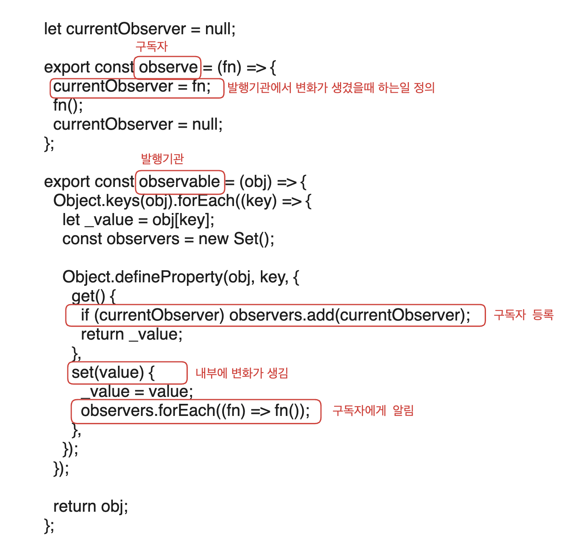

# VanillaJS_Playground

### 옵저버 패턴

- 상태 변화가 있을때마다 메서드 등을 통해 객체가 직접 목록의 각 옵저버에게 통지하도록하는 디자인패턴

### Object.defineProperty

- 객체에 직접 새로운 속성을 정의하거나 이미 존재하는 속성을 수정한 후 그 객체를 반환합니다.
- `Object.defineProperty(obj, prop, descriptor)`
- `obj`: 속성을 정의할 객체
- `prop` : 새로 정의하거나 수정하려는 속성의 이름
- `descriptor` : 새로 정의하거나 수정하려는 속성을 기술하는 객체
- value, writable(데이터 서술자)와 get, set(접근자 서술자)은 동시에 사용할 수 없습니다.

| 속성         | 설명                      | 기본값    | 유형          |
| ------------ | ------------------------- | --------- | ------------- |
| value        | 속성의 값                 | undefined | 데이터 서술자 |
| writable     | 값 수정 불가 처리         | false     | 데이터 서술자 |
| configurable | 속성 변경 or 삭제 불가    | false     | 선택 가능     |
| enumerable   | 반복문에서 속성 반환 설정 | false     | 선택 가능     |
| get, set     | 값의 할당과 호출 설정     | undefined | 접근자 서술자 |

### Observable

- 옵저버들의 목록을 저장할 객체 observers를 생성한다. 중복을 방지하기위해 Set객체를 사용한다.
- getter : observers객체에 currentObserver를 등록한다.
- setter : 변경된 state값을 변경해주고, observers 객체의 observer들을 모두 호출해 상태가 변경됐음을 알린다.

### Observe

- 상태변화가 생겼을때 하는 일을 정의한 함수를 currentObserver변수에 저장한뒤 호출한다.
- currentObserver가 필요한 이유 : 추후 Observable의 getter에서 observers객체에 등록된다.

</img>
