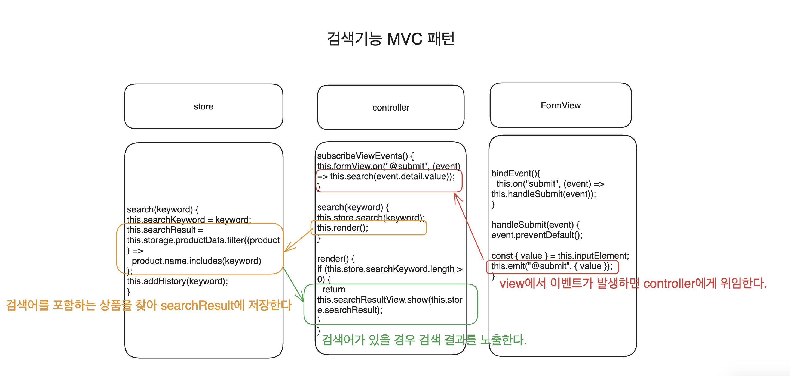

# VanillaJS_Playground

## Model

- 데이터를 관리하는 역할
- 보통 API나 로컬 저장소에 있는 데이터를 가져와 가공

## View

- 사용자가 볼 수 있는 화면을 관리하는 역할
- 데이터를 돔에 출력하거나 사용자가 발생한 이벤트를 처리하는 기능 수행
- HTML,CSS도 뷰에 속함

## Controller

- 서로 격리되어 있는 모델과 뷰를 연결

